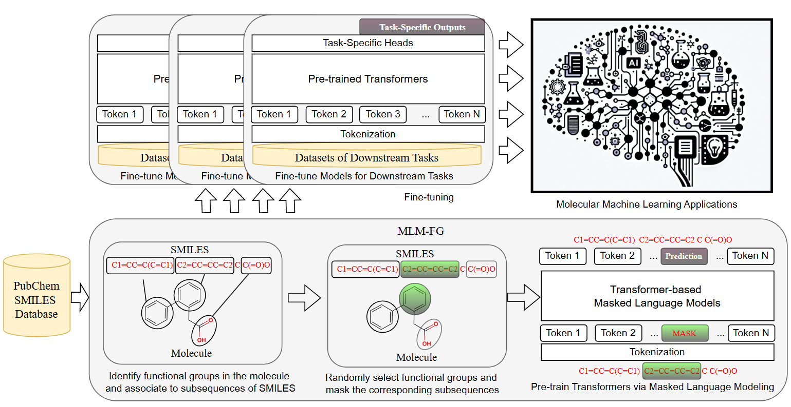

# Pre-trained Molecular Language Models with Random Functional Group Masking

Official Github repository of 

[Pre-trained Molecular Language Models with Random Functional Group Masking](https://arxiv.org/pdf/2411.01401)

- [Tianhao Peng](pengtianhao@buaa.edu.cn)
- [Haoyi Xiong](haoyi.xiong.fr@ieee.org) (Corresponding Author)

## Introduction

Recent advancements in computational chemistry have leveraged the power of trans-former-based language  models, such as MoLFormer, pre-trained using a vast amount of simplified molecular-input line-entry system (SMILES) sequences, to understand and predict molecular properties and activities, a critical step in fields like drug discovery and materials science. To further improve performance, researchers have introduced graph neural networks with graph-based molecular representations, such as GEM, incorporating the topology, geometry, 2D or even 3D structures of molecules into pre-training. While most of molecular graphs in existing studies were automatically converted from SMILES sequences, it is to assume that transformer-based language models might be able to implicitly learn structure-aware representations from SMILES sequences.
In this paper, we propose **MLM-FG** -- a SMILES-based **M**olecular **L**anguage **M**odel, which randomly masking SMILES subsequences corresponding to specific molecular **F**unctional **G**roups to incorporate structure information of atoms during the pre-training phase. This technique aims to compel the model to better infer molecular structures and properties, thus enhancing its predictive capabilities.
Extensive experimental evaluations across 11 benchmark classification and regression tasks in the chemical domain demonstrate the robustness and superiority of MLM-FG. Our findings reveal that MLM-FG outperforms existing pre-training models, either based on SMILES or graphs, in 9 out of the 11 downstream tasks, ranking as a close second in the remaining ones. Remarkably, MLM-FG also surpasses 3D-graph-based models, which explicitly incorporate molecular structures into their inputs, highlighting its exceptional capacity for representation learning even without explicit 3D structural information. These results indicate that MLM-FG effectively captures the nuanced language of molecules, offering promising implications for computational chemistry and related disciplines.


## Framework of MLM-FG


An illustration of the proposed MLM-FG framework: (1) MLM-FG adopts 12-layer multi-head transformer blocks (in either RoBERTa or MoLFormer architectures) with a hidden state dimension of $D_h$=768 for pre-training and fine-tuning, (2) MLM-FG follows a functional group-aware random masking strategy to pre-train the model on a large corpus of 10 to 100 million SMILES sequences from PubChem, and (3) MLM-FG fine-tunes the pre-trained models to support a wide range of molecular machine learning applications.


## Python Environment

We are grateful to the authors of [Molformer](https://github.com/IBM/molformer) for making their code publicly available, which enabled the development of this repository.

### Conda Create and Activate Environment

```
conda create --name MolTran_CUDA11 python=3.8.10
conda activate MolTran_CUDA11
```

### Conda Install Packages
```
conda install pytorch==1.7.1 cudatoolkit=11.0 -c pytorch
conda install numpy=1.22.3 pandas=1.2.4 scikit-learn=0.24.2 scipy=1.6.2
conda install rdkit==2022.03.2 -c conda-forge
```

### Pip install Packages
```
pip install transformers==4.6.0 pytorch-lightning==1.1.5 pytorch-fast-transformers==0.4.0 datasets==1.6.2 jupyterlab==3.4.0 ipywidgets==7.7.0 bertviz==1.4.0
```

### Compile Apex from source

Due to the use of [Apex Optimizers](https://nvidia.github.io/apex/optimizers.html), Apex must be compiled with CUDA and C++ extensions via


```
git clone https://github.com/NVIDIA/apex
cd apex
git checkout tags/22.03 -b v22.03
export CUDA_HOME='Cuda 11 install'
pip install -v --disable-pip-version-check --no-cache-dir --no-build-isolation --config-settings "--build-option=--cpp_ext" --config-settings "--build-option=--cuda_ext" ./
```

## Datasets

Please download the datasets and put these datasets to corresponding folders. [Click to download](https://drive.google.com/drive/folders/16vOW0rzMJJAC0iNFbzb6E_40yQ3lbLaF).

### Pre-training datasets
The datasets (10m, 20m, 100m) are provided in the ``datasets`` folder.

### Fine-tuning datasets
The datasets are provided in the ``datasets`` folder.


## Pre-training
You can run the following code to pre-train the model, you may need to adjust the hyper-parameter like ``scale`` to run experiments on different scale of datasets.
```
cd training
sh run_RoBERTa_pretrain.sh
sh run_Transformer_pretrain.sh
```

## Fine-tuning
You can run the following code to pre-train the model, you may need to adjust the hyper-parameter like ``scale`` to run experiments on different scale of datasets.
```
cd finetuning
sh run_datasets.sh
```

## Files
```
├───data
│   │   README.md
│   │
│   ├───finetune
│   │   ├───bace
│   │   │       bace.csv
│   │   │
│   │   ├───bbbp
│   │   │       BBBP.csv
│   │   │
│   │   ├───clintox
│   │   │       clintox.csv
│   │   │
│   │   ├───esol
│   │   │       esol.csv
│   │   │
│   │   ├───freesolv
│   │   │       freesolv.csv
│   │   │
│   │   ├───hiv
│   │   │       HIV.csv
│   │   │
│   │   ├───lipophilicity
│   │   │       Lipophilicity.csv
│   │   │
│   │   ├───muv
│   │   │       muv.csv
│   │   │
│   │   ├───qm7
│   │   │       qm7.csv
│   │   │
│   │   ├───qm8
│   │   │       qm8.csv
│   │   │
│   │   ├───sider
│   │   │       sider.csv
│   │   │
│   │   └───tox21
│   │           tox21.csv
│   │
│   └───pretrain
│       ├───pubchem-100m
│       │       extend-pubchem-100m-smiles-vocab-exist.json
│       │       extend-pubchem-100m-smiles-vocab-full.json
│       │       pubchem-100m-smiles-vocab-exist.json
│       │       pubchem-100m-smiles-vocab-full.json
│       │       pubchem-100m.txt
│       │
│       ├───pubchem-10m
│       │       extend-pubchem-10m-smiles-vocab-exist.json
│       │       extend-pubchem-10m-smiles-vocab-full.json
│       │       pubchem-10m-smiles-vocab-exist.json
│       │       pubchem-10m-smiles-vocab-full.json
│       │       pubchem-10m.txt
│       │
│       └───pubchem-20m
│               extend-pubchem-10m-smiles-vocab-full.json
│               extend-pubchem-20m-smiles-vocab-full.json
│               pubchem-20m.txt
│
├───finetuning
│   │   args.py
│   │   bert_vocab.txt
│   │   dataset_test.py
│   │   finetune_pubchem_MoLFormer.py
│   │   finetune_pubchem_MoLFormer_multitask.py
│   │   periodic_table_of_elements.json
│   │   run_datasets.sh
│   │   run_one_finetune.sh
│   │   run_one_finetune_multitask.sh
│   │   utils.py
│   │   vocab.txt
│   │
│   ├───checkpoints
│   │       README.md
│   │       RoBERTa_100m.ckpt
│   │       RoBERTa_10m.ckpt
│   │       RoBERTa_20m.ckpt
│   │       trans_100m.ckpt
│   │       trans_10m.ckpt
│   │       trans_20m.ckpt
│   │
│   ├───model
│   │       attention_layer.py
│   │       model_builder.py
│   │       position_encoding.py
│   │
│   ├───rotate_attention
│   │       attention_layer.py
│   │       rotary.py
│   │       rotate_builder.py
│   │
│   └───tokenizer
│           tokenizer.py
│
└───training
    │   args.py
    │   dataset_pubchem.py
    │   periodic_table_of_elements.json
    │   pubchem_canon_zinc_final_vocab_sorted.pth
    │   pubchem_encoder.py
    │   pubchem_smiles_script.py
    │   README.md
    │   run_RoBERTa_pretrain.sh
    │   run_Transformer_pretrain.sh
    │   train_pubchem_light.py
    │   utils.py
    │   val_script.py
    │   zinc_script.py
    │
    ├───lightning_logs
    │   └───logs
    ├───model
    │       attention_layer.py
    │       model_builder.py
    │       position_encoding.py
    │
    └───tokenizer
            tokenizer.py

```

# Citation

@article{peng2024pre,
  title={Pre-trained Molecular Language Models with Random Functional Group Masking},
  author={Peng, Tianhao and Li, Yuchen and Li, Xuhong and Bian, Jiang and Xie, Zeke and Sui, Ning and Mumtaz, Shahid and Xu, Yanwu and Kong, Linghe and Xiong, Haoyi},
  journal={npj Artificial Intelligence},
  year={2025}
}


